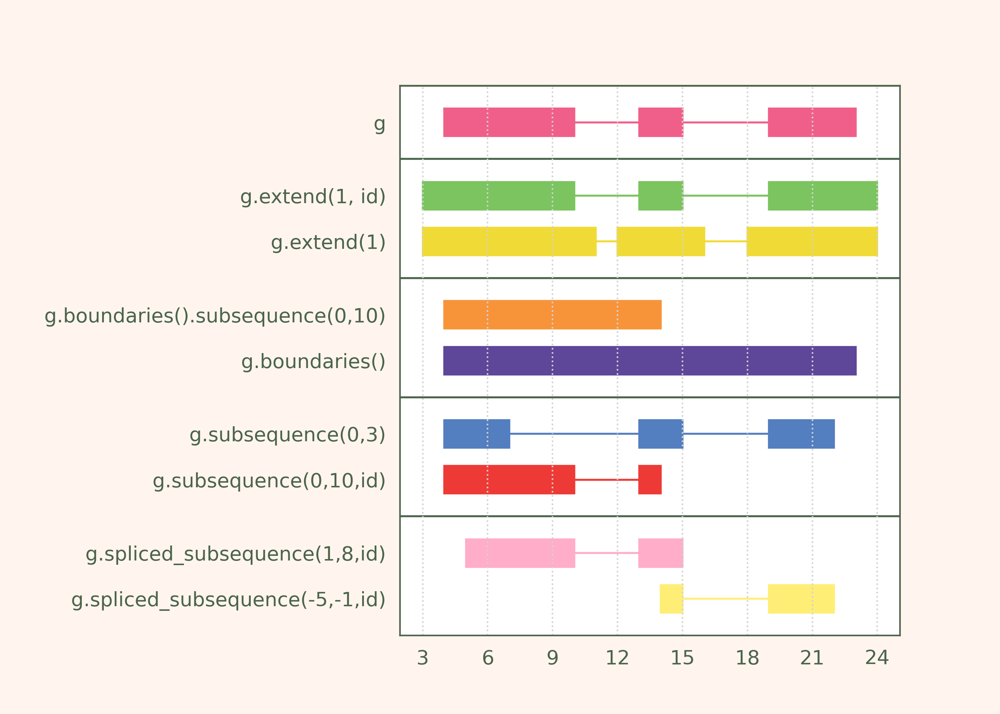
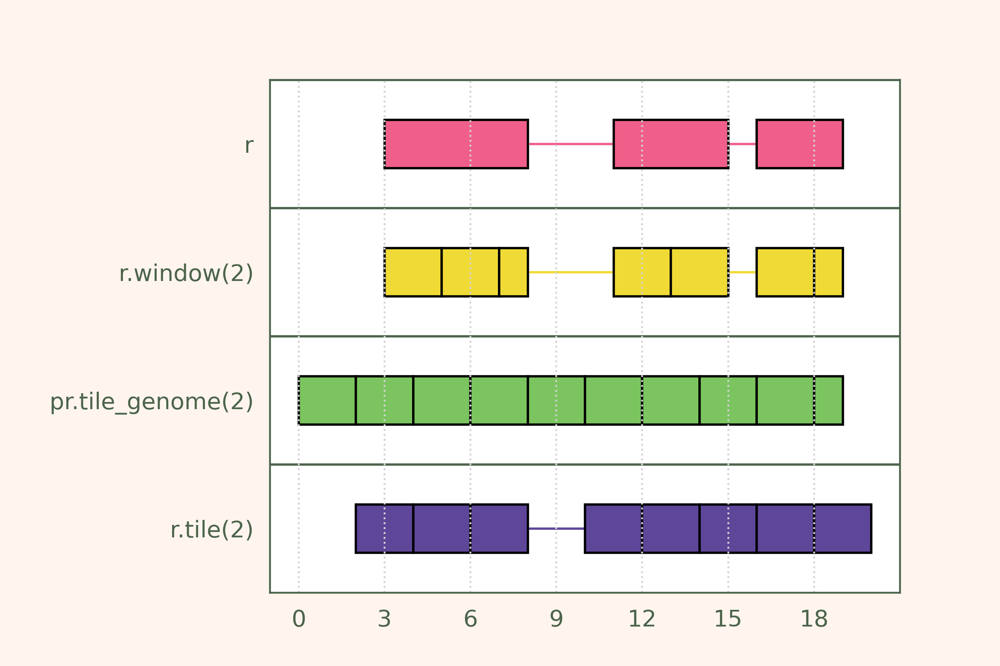

Operating on coordinates
~~~~~~~~~~~~~~~~~~~~~~~~

.. contents::
   :local:
   :depth: 2

Operating on coordinates: cheatsheet
------------------------------------

Modifying coordinates
---------------------
Interval coordinates (Start, End) can be directly modified like any Series in dataframes.
Let's get some data:

  >>> import pyranges as pr
  >>> ex = pr.example_data.ensembl_gtf
  >>> ex = ex[ex.Feature == "exon"].get_with_loc_columns('transcript_id')
  >>> ex = ex.sort_ranges(use_strand=False).reset_index(drop=True)
  >>> ex
    index  |      Chromosome    Start      End  Strand      transcript_id
    int64  |        category    int64    int64  category    object
  -------  ---  ------------  -------  -------  ----------  ---------------
        0  |               1    11868    12227  +           ENST00000456328
        1  |               1    12612    12721  +           ENST00000456328
        2  |               1    13220    14409  +           ENST00000456328
        3  |               1   110952   111357  -           ENST00000471248
        4  |               1   112699   112804  -           ENST00000471248
        5  |               1   120873   120932  -           ENST00000610542
        6  |               1   129054   129223  -           ENST00000610542
        7  |               1   133373   133723  -           ENST00000610542
  PyRanges with 8 rows, 5 columns, and 1 index columns.
  Contains 1 chromosomes and 2 strands.

We can modify a whole column at once:

  >>> ex['Start'] += 5
  >>> ex
    index  |      Chromosome    Start      End  Strand      transcript_id
    int64  |        category    int64    int64  category    object
  -------  ---  ------------  -------  -------  ----------  ---------------
        0  |               1    11873    12227  +           ENST00000456328
        1  |               1    12617    12721  +           ENST00000456328
        2  |               1    13225    14409  +           ENST00000456328
        3  |               1   110957   111357  -           ENST00000471248
        4  |               1   112704   112804  -           ENST00000471248
        5  |               1   120878   120932  -           ENST00000610542
        6  |               1   129059   129223  -           ENST00000610542
        7  |               1   133378   133723  -           ENST00000610542
  PyRanges with 8 rows, 5 columns, and 1 index columns.
  Contains 1 chromosomes and 2 strands.

Or we can modify a slice of the column:

  >>> ex.loc[2:5, 'Start'] -= 5
  >>> ex
    index  |      Chromosome    Start      End  Strand      transcript_id
    int64  |        category    int64    int64  category    object
  -------  ---  ------------  -------  -------  ----------  ---------------
        0  |               1    11873    12227  +           ENST00000456328
        1  |               1    12617    12721  +           ENST00000456328
        2  |               1    13220    14409  +           ENST00000456328
        3  |               1   110952   111357  -           ENST00000471248
        4  |               1   112699   112804  -           ENST00000471248
        5  |               1   120873   120932  -           ENST00000610542
        6  |               1   129059   129223  -           ENST00000610542
        7  |               1   133378   133723  -           ENST00000610542
  PyRanges with 8 rows, 5 columns, and 1 index columns.
  Contains 1 chromosomes and 2 strands.

Or use a boolean index:

  >>> ex.loc[ex.Strand == "+", "Start"] += 5
  >>> e=ex.copy()
  >>> e
    index  |      Chromosome    Start      End  Strand      transcript_id
    int64  |        category    int64    int64  category    object
  -------  ---  ------------  -------  -------  ----------  ---------------
        0  |               1    11878    12227  +           ENST00000456328
        1  |               1    12622    12721  +           ENST00000456328
        2  |               1    13225    14409  +           ENST00000456328
        3  |               1   110952   111357  -           ENST00000471248
        4  |               1   112699   112804  -           ENST00000471248
        5  |               1   120873   120932  -           ENST00000610542
        6  |               1   129059   129223  -           ENST00000610542
        7  |               1   133378   133723  -           ENST00000610542
  PyRanges with 8 rows, 5 columns, and 1 index columns.
  Contains 1 chromosomes and 2 strands.

On the other hand, pyranges offer convenient and intuitive methods to modify coordinates, which deal
with the complexity of intervals and strands.
Next, we will showcase some of its functionalities, using the ``e`` object above as starting point.

Extending intervals
-------------------
The :func:`extend <pyranges.PyRanges.extend>` method allows to extend the intervals in a PyRanges object.
The ``ext`` parameter implies an extension in both directions of all intervals:

  >>> e.extend(ext=5)
    index  |      Chromosome    Start      End  Strand      transcript_id
    int64  |        category    int64    int64  category    object
  -------  ---  ------------  -------  -------  ----------  ---------------
        0  |               1    11873    12232  +           ENST00000456328
        1  |               1    12617    12726  +           ENST00000456328
        2  |               1    13220    14414  +           ENST00000456328
        3  |               1   110947   111362  -           ENST00000471248
        4  |               1   112694   112809  -           ENST00000471248
        5  |               1   120868   120937  -           ENST00000610542
        6  |               1   129054   129228  -           ENST00000610542
        7  |               1   133373   133728  -           ENST00000610542
  PyRanges with 8 rows, 5 columns, and 1 index columns.
  Contains 1 chromosomes and 2 strands.

The ``ext_5`` and ``ext_3`` parameters allow to specify separately the extension in the 5' and 3' directions,
respectively. These operations are strand-aware, meaning that a 5' extension affects the Start position of intervals
on the positive strand, and the End position of intervals on the negative strand, and vice versa for 3' extensions.

Let's extend upstream by 10 bases:

  >>> e.extend(ext_5=10)
    index  |      Chromosome    Start      End  Strand      transcript_id
    int64  |        category    int64    int64  category    object
  -------  ---  ------------  -------  -------  ----------  ---------------
        0  |               1    11868    12227  +           ENST00000456328
        1  |               1    12612    12721  +           ENST00000456328
        2  |               1    13215    14409  +           ENST00000456328
        3  |               1   110952   111367  -           ENST00000471248
        4  |               1   112699   112814  -           ENST00000471248
        5  |               1   120873   120942  -           ENST00000610542
        6  |               1   129059   129233  -           ENST00000610542
        7  |               1   133378   133733  -           ENST00000610542
  PyRanges with 8 rows, 5 columns, and 1 index columns.
  Contains 1 chromosomes and 2 strands.

Let's extend by 12 bases on the 5' end, and 6 bases on the 3' end:

  >>> e.extend(ext_5=12, ext_3=6)
    index  |      Chromosome    Start      End  Strand      transcript_id
    int64  |        category    int64    int64  category    object
  -------  ---  ------------  -------  -------  ----------  ---------------
        0  |               1    11866    12233  +           ENST00000456328
        1  |               1    12610    12727  +           ENST00000456328
        2  |               1    13213    14415  +           ENST00000456328
        3  |               1   110946   111369  -           ENST00000471248
        4  |               1   112693   112816  -           ENST00000471248
        5  |               1   120867   120944  -           ENST00000610542
        6  |               1   129053   129235  -           ENST00000610542
        7  |               1   133372   133735  -           ENST00000610542
  PyRanges with 8 rows, 5 columns, and 1 index columns.
  Contains 1 chromosomes and 2 strands.

To ignore strand (i.e. treat all intervals as if on the positive strand), use ``use_strand=False``:

  >>> e.extend(ext_5=12, ext_3=6, use_strand=False)
    index  |      Chromosome    Start      End  Strand      transcript_id
    int64  |        category    int64    int64  category    object
  -------  ---  ------------  -------  -------  ----------  ---------------
        0  |               1    11866    12233  +           ENST00000456328
        1  |               1    12610    12727  +           ENST00000456328
        2  |               1    13213    14415  +           ENST00000456328
        3  |               1   110940   111363  -           ENST00000471248
        4  |               1   112687   112810  -           ENST00000471248
        5  |               1   120861   120938  -           ENST00000610542
        6  |               1   129047   129229  -           ENST00000610542
        7  |               1   133366   133729  -           ENST00000610542
  PyRanges with 8 rows, 5 columns, and 1 index columns.
  Contains 1 chromosomes and 2 strands.

In all examples above, the extension is applied independently to all intervals in the PyRanges object.
Alternatively, you can group intervals by a column, specified with the ``transcript_id`` argument.
When provided, extensions are relative to the transcript, not the interval. In practice, only the first and/or last
exons of each transcript may be extended:

  >>> e.extend(ext_5=10, transcript_id='transcript_id')
    index  |      Chromosome    Start      End  Strand      transcript_id
    int64  |        category    int64    int64  category    object
  -------  ---  ------------  -------  -------  ----------  ---------------
        0  |               1    11868    12227  +           ENST00000456328
        1  |               1    12622    12721  +           ENST00000456328
        2  |               1    13225    14409  +           ENST00000456328
        3  |               1   110952   111357  -           ENST00000471248
        4  |               1   112699   112814  -           ENST00000471248
        5  |               1   120873   120932  -           ENST00000610542
        6  |               1   129059   129223  -           ENST00000610542
        7  |               1   133378   133733  -           ENST00000610542
  PyRanges with 8 rows, 5 columns, and 1 index columns.
  Contains 1 chromosomes and 2 strands.

Subsequence operations
----------------------

Subsequence operations are operations that slice the intervals in a PyRanges object to obtain smaller intervals.
Intervals may be treated independently (default) or grouped in transcripts.

Method :func:`subsequence <pyranges.PyRanges.subsequence>` allows to
obtain subsequences by specifying the ``start`` and ``end`` position, in python notation.
So, to get the first 10 bases of each interval, we can do:

  >>> e.subsequence(start=0, end=10)
    index  |      Chromosome    Start      End  Strand      transcript_id
    int64  |        category    int64    int64  category    object
  -------  ---  ------------  -------  -------  ----------  ---------------
        0  |               1    11878    11888  +           ENST00000456328
        1  |               1    12622    12632  +           ENST00000456328
        2  |               1    13225    13235  +           ENST00000456328
        3  |               1   111347   111357  -           ENST00000471248
        4  |               1   112794   112804  -           ENST00000471248
        5  |               1   120922   120932  -           ENST00000610542
        6  |               1   129213   129223  -           ENST00000610542
        7  |               1   133713   133723  -           ENST00000610542
  PyRanges with 8 rows, 5 columns, and 1 index columns.
  Contains 1 chromosomes and 2 strands.

Note above that positions refer to the 5' end of intervals, meaning that counting
occurs from right to left for intervals on the negative strand.
You can ignore strand using ``use_strand=False``:

  >>> e.subsequence(start=0, end=10, use_strand=False)
    index  |      Chromosome    Start      End  Strand      transcript_id
    int64  |        category    int64    int64  category    object
  -------  ---  ------------  -------  -------  ----------  ---------------
        0  |               1    11878    11888  +           ENST00000456328
        1  |               1    12622    12632  +           ENST00000456328
        2  |               1    13225    13235  +           ENST00000456328
        3  |               1   110952   110962  -           ENST00000471248
        4  |               1   112699   112709  -           ENST00000471248
        5  |               1   120873   120883  -           ENST00000610542
        6  |               1   129059   129069  -           ENST00000610542
        7  |               1   133378   133388  -           ENST00000610542
  PyRanges with 8 rows, 5 columns, and 1 index columns.
  Contains 1 chromosomes and 2 strands.

``start`` and ``end`` can be provided as positional arguments. ``end`` can be omitted.
When requesting a slice that is entirely out of bounds, the corresponding rows are absent in output.
The following yields intervals from position 200 to their existing 3' end
(i.e. we remove the first 200 bases of each interval).
Note that intervals that were <200 bp have no row in output:

  >>> e.subsequence(200)
    index  |      Chromosome    Start      End  Strand      transcript_id
    int64  |        category    int64    int64  category    object
  -------  ---  ------------  -------  -------  ----------  ---------------
        0  |               1    12078    12227  +           ENST00000456328
        2  |               1    13425    14409  +           ENST00000456328
        3  |               1   110952   111157  -           ENST00000471248
        7  |               1   133378   133523  -           ENST00000610542
  PyRanges with 4 rows, 5 columns, and 1 index columns.
  Contains 1 chromosomes and 2 strands.

Positions can be negative, in which case they are counted from the end of the interval.
To get the last 10 bases of each interval, we can do:

  >>> e.subsequence(-10)
    index  |      Chromosome    Start      End  Strand      transcript_id
    int64  |        category    int64    int64  category    object
  -------  ---  ------------  -------  -------  ----------  ---------------
        0  |               1    12217    12227  +           ENST00000456328
        1  |               1    12711    12721  +           ENST00000456328
        2  |               1    14399    14409  +           ENST00000456328
        3  |               1   110952   110962  -           ENST00000471248
        4  |               1   112699   112709  -           ENST00000471248
        5  |               1   120873   120883  -           ENST00000610542
        6  |               1   129059   129069  -           ENST00000610542
        7  |               1   133378   133388  -           ENST00000610542
  PyRanges with 8 rows, 5 columns, and 1 index columns.
  Contains 1 chromosomes and 2 strands.

This returns intervals without their first and last 3 bases:

  >>> e.subsequence(3, -3)
    index  |      Chromosome    Start      End  Strand      transcript_id
    int64  |        category    int64    int64  category    object
  -------  ---  ------------  -------  -------  ----------  ---------------
        0  |               1    11881    12224  +           ENST00000456328
        1  |               1    12625    12718  +           ENST00000456328
        2  |               1    13228    14406  +           ENST00000456328
        3  |               1   110955   111354  -           ENST00000471248
        4  |               1   112702   112801  -           ENST00000471248
        5  |               1   120876   120929  -           ENST00000610542
        6  |               1   129062   129220  -           ENST00000610542
        7  |               1   133381   133720  -           ENST00000610542
  PyRanges with 8 rows, 5 columns, and 1 index columns.
  Contains 1 chromosomes and 2 strands.

Above, each interval is treated independently. Alternatively, you can consider transcripts,
grouping intervals (i.e. exons) by a column, specified with the ``transcript_id`` argument.
When provided, subsequences are relative to the transcript, not the interval.

Note that using ``transcript_id`` assumes that exons belonging to the same transcript have no overlap; on the other hand,
it does not assume presorting of intervals.

So, the following will get the subintervals included in the first 1500 bases of each transcript:

  >>> e.subsequence(0, 1500, transcript_id='transcript_id')
    index  |      Chromosome    Start      End  Strand      transcript_id
    int64  |        category    int64    int64  category    object
  -------  ---  ------------  -------  -------  ----------  ---------------
        0  |               1    11878    12227  +           ENST00000456328
        1  |               1    12622    12721  +           ENST00000456328
        2  |               1    13225    13378  +           ENST00000456328
        3  |               1   111304   111357  -           ENST00000471248
        4  |               1   112699   112804  -           ENST00000471248
        7  |               1   133378   133723  -           ENST00000610542
  PyRanges with 6 rows, 5 columns, and 1 index columns.
  Contains 1 chromosomes and 2 strands.

Note that :func:`subsequence <pyranges.PyRanges.subsequence>`  counts positions from the 5' to the 3' of the transcript,
in **genomic coordinates**, that is, they refer to the whole unspliced transcript, including exons as well as introns.

Thus, the command above is equivalent to requesting the portions of intervals
that overlap with the first 1500 bases of the boundaries of each transcript:

  >>> b = e.boundaries('transcript_id')
  >>> b
    index  |      Chromosome    Start      End  Strand      transcript_id
    int64  |        category    int64    int64  category    object
  -------  ---  ------------  -------  -------  ----------  ---------------
        0  |               1    11878    14409  +           ENST00000456328
        1  |               1   110952   112804  -           ENST00000471248
        2  |               1   120873   133723  -           ENST00000610542
  PyRanges with 3 rows, 5 columns, and 1 index columns.
  Contains 1 chromosomes and 2 strands.

  >>> e.intersect( b.subsequence(0, 1500) )
    index  |      Chromosome    Start      End  Strand      transcript_id
    int64  |        category    int64    int64  category    object
  -------  ---  ------------  -------  -------  ----------  ---------------
        0  |               1    11878    12227  +           ENST00000456328
        1  |               1    12622    12721  +           ENST00000456328
        2  |               1    13225    13378  +           ENST00000456328
        3  |               1   111304   111357  -           ENST00000471248
        4  |               1   112699   112804  -           ENST00000471248
        7  |               1   133378   133723  -           ENST00000610542
  PyRanges with 6 rows, 5 columns, and 1 index columns.
  Contains 1 chromosomes and 2 strands.

Often, we may want to count positions along the mRNA, i.e. in spliced transcript coordinates.
This can be achieved using :func:`spliced_subsequence <pyranges.PyRanges.spliced_subsequence>`.
Below we request the first 1500 bases of each spliced transcript. Only
exons are counted to sum up to that length, and introns are ignored:

  >>> e.spliced_subsequence(0, 1500, transcript_id='transcript_id')
    index  |      Chromosome    Start      End  Strand      transcript_id
    int64  |        category    int64    int64  category    object
  -------  ---  ------------  -------  -------  ----------  ---------------
        0  |               1    11878    12227  +           ENST00000456328
        1  |               1    12622    12721  +           ENST00000456328
        2  |               1    13225    14277  +           ENST00000456328
        3  |               1   110952   111357  -           ENST00000471248
        4  |               1   112699   112804  -           ENST00000471248
        5  |               1   120873   120932  -           ENST00000610542
        6  |               1   129059   129223  -           ENST00000610542
        7  |               1   133378   133723  -           ENST00000610542
  PyRanges with 8 rows, 5 columns, and 1 index columns.
  Contains 1 chromosomes and 2 strands.

In the ``e`` object, only ENST00000456328 is larger than 1500 bases.
Compare it with the result above, noting that its third exon has been shortened:

  >>> e
    index  |      Chromosome    Start      End  Strand      transcript_id
    int64  |        category    int64    int64  category    object
  -------  ---  ------------  -------  -------  ----------  ---------------
        0  |               1    11878    12227  +           ENST00000456328
        1  |               1    12622    12721  +           ENST00000456328
        2  |               1    13225    14409  +           ENST00000456328
        3  |               1   110952   111357  -           ENST00000471248
        4  |               1   112699   112804  -           ENST00000471248
        5  |               1   120873   120932  -           ENST00000610542
        6  |               1   129059   129223  -           ENST00000610542
        7  |               1   133378   133723  -           ENST00000610542
  PyRanges with 8 rows, 5 columns, and 1 index columns.
  Contains 1 chromosomes and 2 strands.

:func:`spliced_subsequence <pyranges.PyRanges.spliced_subsequence>` accepts the same argument as
:func:`subsequence <pyranges.PyRanges.subsequence>`, and can be used in the same way.
So, this will get the first and last 10 bases of each spliced transcript:

  >>> first10 = e.spliced_subsequence(0, 10, transcript_id='transcript_id')
  >>> last10 = e.spliced_subsequence(-10, transcript_id='transcript_id')
  >>> pr.concat([first10, last10])
    index  |      Chromosome    Start      End  Strand      transcript_id
    int64  |        category    int64    int64  category    object
  -------  ---  ------------  -------  -------  ----------  ---------------
        0  |               1    11878    11888  +           ENST00000456328
        4  |               1   112794   112804  -           ENST00000471248
        7  |               1   133713   133723  -           ENST00000610542
        2  |               1    14399    14409  +           ENST00000456328
        3  |               1   110952   110962  -           ENST00000471248
        5  |               1   120873   120883  -           ENST00000610542
  PyRanges with 6 rows, 5 columns, and 1 index columns.
  Contains 1 chromosomes and 2 strands.

Subsequence operations can be combined with extensions to obtain intervals adjacent to the input ones.
For example, this will obtain the 100 bases upstream of each transcript:

  >>> e.extend(ext_5=100, transcript_id='transcript_id').subsequence(0, 100, transcript_id='transcript_id')
    index  |      Chromosome    Start      End  Strand      transcript_id
    int64  |        category    int64    int64  category    object
  -------  ---  ------------  -------  -------  ----------  ---------------
        0  |               1    11778    11878  +           ENST00000456328
        4  |               1   112804   112904  -           ENST00000471248
        7  |               1   133723   133823  -           ENST00000610542
  PyRanges with 3 rows, 5 columns, and 1 index columns.
  Contains 1 chromosomes and 2 strands.

This will obtain the 100 bases downstream of each transcript:

  >>> e.extend(ext_3=100, transcript_id='transcript_id').subsequence(-100, transcript_id='transcript_id')
    index  |      Chromosome    Start      End  Strand      transcript_id
    int64  |        category    int64    int64  category    object
  -------  ---  ------------  -------  -------  ----------  ---------------
        2  |               1    14409    14509  +           ENST00000456328
        3  |               1   110852   110952  -           ENST00000471248
        5  |               1   120773   120873  -           ENST00000610542
  PyRanges with 3 rows, 5 columns, and 1 index columns.
  Contains 1 chromosomes and 2 strands.

Other slicing operations
------------------------

Many genomic analyses involved running a sliding window over the genome or subregions of it.
Method :func:`window <pyranges.PyRanges.window>` allows to obtain adjacent windows of a specified size and step that
span each interval in a PyRanges object.

  >>> g = pr.PyRanges(dict(Chromosome=1, Start=[4, 60, 100], End=[11, 66, 107],
  ...                      Strand=['+', '+', '-'], Name=['a', 'a', 'b']))
  >>> g
    index  |      Chromosome    Start      End  Strand    Name
    int64  |           int64    int64    int64  object    object
  -------  ---  ------------  -------  -------  --------  --------
        0  |               1        4       11  +         a
        1  |               1       60       66  +         a
        2  |               1      100      107  -         b
  PyRanges with 3 rows, 5 columns, and 1 index columns.
  Contains 1 chromosomes and 2 strands.

For example, let's get windows of size 3:

  >>> g.window(3)
    index  |      Chromosome    Start      End  Strand    Name
    int64  |           int64    int64    int64  object    object
  -------  ---  ------------  -------  -------  --------  --------
        0  |               1        4        7  +         a
        0  |               1        7       10  +         a
        0  |               1       10       11  +         a
        1  |               1       60       63  +         a
        1  |               1       63       66  +         a
        2  |               1      104      107  -         b
        2  |               1      101      104  -         b
        2  |               1      100      101  -         b
  PyRanges with 8 rows, 5 columns, and 1 index columns (with 5 index duplicates).
  Contains 1 chromosomes and 2 strands.

Windows are generated for each interval independently. Strand is considered: they are generated starting from the 5'
end. To ignore strand, use ``use_strand=False``:

  >>> g.window(3, use_strand=False)
    index  |      Chromosome    Start      End  Strand    Name
    int64  |           int64    int64    int64  object    object
  -------  ---  ------------  -------  -------  --------  --------
        0  |               1        4        7  +         a
        0  |               1        7       10  +         a
        0  |               1       10       11  +         a
        1  |               1       60       63  +         a
        1  |               1       63       66  +         a
        2  |               1      100      103  -         b
        2  |               1      103      106  -         b
        2  |               1      106      107  -         b
  PyRanges with 8 rows, 5 columns, and 1 index columns (with 5 index duplicates).
  Contains 1 chromosomes and 2 strands.

To avoid duplicated indices, run pandas dataframe method ``reset_index`` on the output:

  >>> g.window(3).reset_index(drop=True)
    index  |      Chromosome    Start      End  Strand    Name
    int64  |           int64    int64    int64  object    object
  -------  ---  ------------  -------  -------  --------  --------
        0  |               1        4        7  +         a
        1  |               1        7       10  +         a
        2  |               1       10       11  +         a
        3  |               1       60       63  +         a
        4  |               1       63       66  +         a
        5  |               1      104      107  -         b
        6  |               1      101      104  -         b
        7  |               1      100      101  -         b
  PyRanges with 8 rows, 5 columns, and 1 index columns.
  Contains 1 chromosomes and 2 strands.

To may retain the old index as column, with:

  >>> g.window(3).reset_index(names='g_index')
    index  |      g_index    Chromosome    Start      End  Strand    Name
    int64  |        int64         int64    int64    int64  object    object
  -------  ---  ---------  ------------  -------  -------  --------  --------
        0  |            0             1        4        7  +         a
        1  |            0             1        7       10  +         a
        2  |            0             1       10       11  +         a
        3  |            1             1       60       63  +         a
        4  |            1             1       63       66  +         a
        5  |            2             1      104      107  -         b
        6  |            2             1      101      104  -         b
        7  |            2             1      100      101  -         b
  PyRanges with 8 rows, 6 columns, and 1 index columns.
  Contains 1 chromosomes and 2 strands.

To 'window' a whole genome (e.g. to then quantify reads in each window), pyranges offers
:func:`pyranges.tile_genome`. Here, you must provide chromosome sizes, with various syntaxes accepted, and again a
window size. This function will return windows to cover all the chromosomes:

  >>> cs={'chr1':323, 'chr2':125} # creating a dictionary with chromosome sizes
  >>> pr.tile_genome(cs, 100)
    index  |    Chromosome      Start      End
    int64  |    object          int64    int64
  -------  ---  ------------  -------  -------
        0  |    chr1                0      100
        1  |    chr1              100      200
        2  |    chr1              200      300
        3  |    chr1              300      323
        4  |    chr2                0      100
        5  |    chr2              100      125
  PyRanges with 6 rows, 3 columns, and 1 index columns.
  Contains 2 chromosomes.

Note that the last window is not full, as the chromosome size is not a multiple of the window size.
To ensure tile size consistency, use the ``full_last_tile`` parameter:

  >>> pr.tile_genome(cs, 100, full_last_tile=True)
    index  |    Chromosome      Start      End
    int64  |    object          int64    int64
  -------  ---  ------------  -------  -------
        0  |    chr1                0      100
        1  |    chr1              100      200
        2  |    chr1              200      300
        3  |    chr1              300      400
        4  |    chr2                0      100
        5  |    chr2              100      200
  PyRanges with 6 rows, 3 columns, and 1 index columns.
  Contains 2 chromosomes.

A related operation is :func:`tile <pyranges.PyRanges.tile>`, whose rationale is to obtain only the genome tiles (of
a defined size) that overlap the intervals in a PyRanges object:

  >>> se = e.loc[[0,7],:]
  >>> se
    index  |      Chromosome    Start      End  Strand      transcript_id
    int64  |        category    int64    int64  category    object
  -------  ---  ------------  -------  -------  ----------  ---------------
        0  |               1    11878    12227  +           ENST00000456328
        7  |               1   133378   133723  -           ENST00000610542
  PyRanges with 2 rows, 5 columns, and 1 index columns.
  Contains 1 chromosomes and 2 strands.

  >>> se.tile(200)
    index  |      Chromosome    Start      End  Strand      transcript_id
    int64  |        category    int64    int64  category    object
  -------  ---  ------------  -------  -------  ----------  ---------------
        0  |               1    11800    12000  +           ENST00000456328
        0  |               1    12000    12200  +           ENST00000456328
        0  |               1    12200    12400  +           ENST00000456328
        7  |               1   133200   133400  -           ENST00000610542
        7  |               1   133400   133600  -           ENST00000610542
        7  |               1   133600   133800  -           ENST00000610542
  PyRanges with 6 rows, 5 columns, and 1 index columns (with 4 index duplicates).
  Contains 1 chromosomes and 2 strands.

Note that, in contrast with :func:`window <pyranges.PyRanges.window>`, the function
:func:`tile <pyranges.PyRanges.tile>` returns intervals anchored to genome positions: their Start will always be
a multiple of the tile size, like :func:`pyranges.tile_genome`, and regardless of the strand of the original intervals.
Argument ``overlap_column`` can be used to add a column indicating how much of the original interval
overlaps with the tile returned:

  >>> se.tile(200, overlap_column='nts')
    index  |      Chromosome    Start      End  Strand      transcript_id        nts
    int64  |        category    int64    int64  category    object             int64
  -------  ---  ------------  -------  -------  ----------  ---------------  -------
        0  |               1    11800    12000  +           ENST00000456328      122
        0  |               1    12000    12200  +           ENST00000456328      200
        0  |               1    12200    12400  +           ENST00000456328       27
        7  |               1   133200   133400  -           ENST00000610542       22
        7  |               1   133400   133600  -           ENST00000610542      200
        7  |               1   133600   133800  -           ENST00000610542      123
  PyRanges with 6 rows, 6 columns, and 1 index columns (with 4 index duplicates).
  Contains 1 chromosomes and 2 strands.
