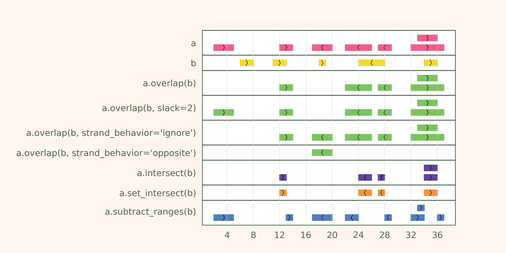

Overlap-related operations
~~~~~~~~~~~~~~~~~~~~~~~~~~

.. contents::
   :local:
   :depth: 2

Pyranges offers many efficient methods to detect / process overlaps. We present them here split in two groups:

1. Methods accepting a **pair of PyRanges** as input:

.. autosummary::
    :toctree: _generated_hidden
    :template: custom_method_summary.rst

    pyranges.PyRanges.overlap
    pyranges.PyRanges.join_ranges
    pyranges.PyRanges.set_intersect
    pyranges.PyRanges.set_union
    pyranges.PyRanges.intersect
    pyranges.PyRanges.subtract_ranges
    pyranges.PyRanges.count_overlaps
    pyranges.PyRanges.nearest

2. Methods accepting a **single PyRanges** as input:

.. autosummary::
    :toctree: _generated_hidden2
    :template: custom_method_summary.rst

    pyranges.PyRanges.cluster
    pyranges.PyRanges.merge_overlaps
    pyranges.PyRanges.split
    pyranges.PyRanges.max_disjoint

Overlap-related operations: cheatsheet
======================================

Methods for pairs of PyRanges
=============================
These methods accept two PyRanges objects as input (i.e. self and other),
and return a new PyRanges object with the results of the operation.

We will briefly showcase them in this document. First, let's create two PyRanges objects to work with:

  >>> import pyranges as pr
  >>> a = pr.PyRanges(dict(Chromosome="chr1",
  ...                      Start=[3, 13, 18, 23, 28, 32, 33],
  ...                      End=[6, 15, 21, 27, 29, 37, 36],
  ...                      Strand=["+", "+", "-", "-", "-", "+", "+"]))
  >>> a
    index  |    Chromosome      Start      End  Strand
    int64  |    object          int64    int64  object
  -------  ---  ------------  -------  -------  --------
        0  |    chr1                3        6  +
        1  |    chr1               13       15  +
        2  |    chr1               18       21  -
        3  |    chr1               23       27  -
        4  |    chr1               28       29  -
        5  |    chr1               32       37  +
        6  |    chr1               33       36  +
  PyRanges with 7 rows, 4 columns, and 1 index columns.
  Contains 1 chromosomes and 2 strands.

  >>> b = pr.PyRanges(dict(Chromosome="chr1",
  ...                      Start=[6, 12, 19, 25, 34],
  ...                      End=[8, 14, 20, 29, 36],
  ...                      Strand=["+", "+", "+", "-", "+"]))
  >>> b
    index  |    Chromosome      Start      End  Strand
    int64  |    object          int64    int64  object
  -------  ---  ------------  -------  -------  --------
        0  |    chr1                6        8  +
        1  |    chr1               12       14  +
        2  |    chr1               19       20  +
        3  |    chr1               25       29  -
        4  |    chr1               34       36  +
  PyRanges with 5 rows, 4 columns, and 1 index columns.
  Contains 1 chromosomes and 2 strands.

Filter rows: overlap
--------------------

The most intuitive overlap-related method is :func:`overlap <pyranges.PyRanges.overlap>`.
This is simply a filter of the intervals in self, so that only those overlapping any interval in other are returned:

  >>> a.overlap(b)
    index  |    Chromosome      Start      End  Strand
    int64  |    object          int64    int64  object
  -------  ---  ------------  -------  -------  --------
        1  |    chr1               13       15  +
        3  |    chr1               23       27  -
        4  |    chr1               28       29  -
        5  |    chr1               32       37  +
        6  |    chr1               33       36  +
  PyRanges with 5 rows, 4 columns, and 1 index columns.
  Contains 1 chromosomes and 2 strands.

Let's now filter the rows of the other PyRanges object:

  >>> b.overlap(a)
    index  |    Chromosome      Start      End  Strand
    int64  |    object          int64    int64  object
  -------  ---  ------------  -------  -------  --------
        1  |    chr1               12       14  +
        3  |    chr1               25       29  -
        4  |    chr1               34       36  +
  PyRanges with 3 rows, 4 columns, and 1 index columns.
  Contains 1 chromosomes and 2 strands.

Note above how intervals overlapping with more than one interval in the other PyRanges are reported just once.

To get the self intervals **without overlap** in other, use ``invert=True``:

  >>> a.overlap(b, invert=True)
    index  |    Chromosome      Start      End  Strand
    int64  |    object          int64    int64  object
  -------  ---  ------------  -------  -------  --------
        0  |    chr1                3        6  +
        2  |    chr1               18       21  -
  PyRanges with 2 rows, 4 columns, and 1 index columns.
  Contains 1 chromosomes and 2 strands.

A reminder that intervals are encoded in pythonic convention:
0-based coordinates, with start included and end excluded.
Thus, the closest possible intervals that are not overlapping are two intervals wherein
the end of the first is equal of the start of the second. These are called **"bookended"** intervals, e.g.:

  >>> a.head(1)
    index  |    Chromosome      Start      End  Strand
    int64  |    object          int64    int64  object
  -------  ---  ------------  -------  -------  --------
        0  |    chr1                3        6  +
  PyRanges with 1 rows, 4 columns, and 1 index columns.
  Contains 1 chromosomes and 1 strands.

  >>> b.head(1)
    index  |    Chromosome      Start      End  Strand
    int64  |    object          int64    int64  object
  -------  ---  ------------  -------  -------  --------
        0  |    chr1                6        8  +
  PyRanges with 1 rows, 4 columns, and 1 index columns.
  Contains 1 chromosomes and 1 strands.

Common arguments: slack, strand_behavior, match_by
--------------------------------------------------

We will now use :func:`overlap <pyranges.PyRanges.overlap>` to showcase arguments
that are available in many overlap-related methods.

``slack`` (default: 0) is used to relax the criteria of overlap.
A value of 1 will report bookended intervals, previously not considered overlapping:

  >>> a.overlap(b, slack=1)
    index  |    Chromosome      Start      End  Strand
    int64  |    object          int64    int64  object
  -------  ---  ------------  -------  -------  --------
        0  |    chr1                3        6  +
        1  |    chr1               13       15  +
        3  |    chr1               23       27  -
        4  |    chr1               28       29  -
        5  |    chr1               32       37  +
        6  |    chr1               33       36  +
  PyRanges with 6 rows, 4 columns, and 1 index columns.
  Contains 1 chromosomes and 2 strands.

Analogously, higher values will report  increasingly distant intervals.
In practice, the self intervals are temporarily extended by the slack amount on both ends before the overlap operation.

``strand_behavior`` determines how strand is treated.
The value 'same' results in the intuitive behavior, i.e. two intervals overlap only if on the same strand:

  >>> a.overlap(b, strand_behavior="same")  # the result here is the same as: a.overlap(b)
    index  |    Chromosome      Start      End  Strand
    int64  |    object          int64    int64  object
  -------  ---  ------------  -------  -------  --------
        1  |    chr1               13       15  +
        3  |    chr1               23       27  -
        4  |    chr1               28       29  -
        5  |    chr1               32       37  +
        6  |    chr1               33       36  +
  PyRanges with 5 rows, 4 columns, and 1 index columns.
  Contains 1 chromosomes and 2 strands.

On the other hand, value 'ignore' will define overlaps regardless of strands:

  >>> a.overlap(b, strand_behavior="ignore")
    index  |    Chromosome      Start      End  Strand
    int64  |    object          int64    int64  object
  -------  ---  ------------  -------  -------  --------
        1  |    chr1               13       15  +
        2  |    chr1               18       21  -
        3  |    chr1               23       27  -
        4  |    chr1               28       29  -
        5  |    chr1               32       37  +
        6  |    chr1               33       36  +
  PyRanges with 6 rows, 4 columns, and 1 index columns.
  Contains 1 chromosomes and 2 strands.

Value 'opposite' will require two intervals to be on the opposite strands to be considered overlapping:

  >>> a.overlap(b, strand_behavior="opposite")
    index  |    Chromosome      Start      End  Strand
    int64  |    object          int64    int64  object
  -------  ---  ------------  -------  -------  --------
        2  |    chr1               18       21  -
  PyRanges with 1 rows, 4 columns, and 1 index columns.
  Contains 1 chromosomes and 1 strands.

Naturally, values 'same' and 'opposite' can only be used when the PyRanges objects have
valid strand information, i.e. the Strand column is present and all its values are either '+' or '-':

  >>> b_unstranded = b.remove_strand()
  >>> b_unstranded
    index  |    Chromosome      Start      End
    int64  |    object          int64    int64
  -------  ---  ------------  -------  -------
        0  |    chr1                6        8
        1  |    chr1               12       14
        2  |    chr1               19       20
        3  |    chr1               25       29
        4  |    chr1               34       36
  PyRanges with 5 rows, 3 columns, and 1 index columns.
  Contains 1 chromosomes.

  >>> a.overlap(b_unstranded, strand_behavior="same")
  Traceback (most recent call last):
    ...
  ValueError: Can only do same strand operations when both PyRanges contain valid strand info.

See function :func:`strand_valid <pyranges.PyRanges.strand_valid>` for details, and
:func:`make_strand_valid <pyranges.PyRanges.make_strand_valid>` to convert non-standard strand values to standard ones.

The default value of ``strand_behavior`` is 'auto'.
This is transformed to 'same' if both PyRanges have valid strands, and to 'ignore' otherwise:

  >>> a.overlap(b).equals(
  ... a.overlap(b, strand_behavior='same') )
  True

  >>> a.overlap(b_unstranded).equals(
  ... a.overlap(b, strand_behavior='ignore') )
  True

Above, we leveraged method ``equals`` inherited from pandas Dataframe to compare table contents.

Note that the presence of any non-standard Strand value will result in strand being ignored for all rows.
When leading to potentially non-intuitive behavior, a warning is printed:

  >>> a_invalid = a.copy()
  >>> a_invalid.loc[2, 'Strand'] = "."
  >>> a_invalid
    index  |    Chromosome      Start      End  Strand
    int64  |    object          int64    int64  object
  -------  ---  ------------  -------  -------  --------
        0  |    chr1                3        6  +
        1  |    chr1               13       15  +
        2  |    chr1               18       21  .
        3  |    chr1               23       27  -
        4  |    chr1               28       29  -
        5  |    chr1               32       37  +
        6  |    chr1               33       36  +
  PyRanges with 7 rows, 4 columns, and 1 index columns.
  Contains 1 chromosomes and 3 strands (including non-genomic strands: .).

  >>> a_invalid.overlap(b)  # doctest: +SKIP
  <input>:1: UserWarning: overlap: 'auto' strand_behavior treated as ignore due to invalid Strand values. Please use strand_behavior=ignore
    index  |    Chromosome      Start      End  Strand
    int64  |    object          int64    int64  object
  -------  ---  ------------  -------  -------  --------
        1  |    chr1               13       15  +
        2  |    chr1               18       21  .
        3  |    chr1               23       27  -
        4  |    chr1               28       29  -
        5  |    chr1               32       37  +
        6  |    chr1               33       36  +
  PyRanges with 6 rows, 4 columns, and 1 index columns.
  Contains 1 chromosomes and 3 strands (including non-genomic strands: .).

Finally, argument ``match_by`` can be used to specify additional columns whose values must match for two intervals
to be considered overlapping.
For example, let's add a column to both objects to mark intervals whose Start is an odd number, then
use this column to filter the overlaps:

  >>> a2 = a.assign(odd = lambda x:x.Start % 2 )
  >>> a2
    index  |    Chromosome      Start      End  Strand        odd
    int64  |    object          int64    int64  object      int64
  -------  ---  ------------  -------  -------  --------  -------
        0  |    chr1                3        6  +               1
        1  |    chr1               13       15  +               1
        2  |    chr1               18       21  -               0
        3  |    chr1               23       27  -               1
        4  |    chr1               28       29  -               0
        5  |    chr1               32       37  +               0
        6  |    chr1               33       36  +               1
  PyRanges with 7 rows, 5 columns, and 1 index columns.
  Contains 1 chromosomes and 2 strands.

  >>> b2 = b.assign(odd = lambda x:x.Start % 2 )
  >>> b2
    index  |    Chromosome      Start      End  Strand        odd
    int64  |    object          int64    int64  object      int64
  -------  ---  ------------  -------  -------  --------  -------
        0  |    chr1                6        8  +               0
        1  |    chr1               12       14  +               0
        2  |    chr1               19       20  +               1
        3  |    chr1               25       29  -               1
        4  |    chr1               34       36  +               0
  PyRanges with 5 rows, 5 columns, and 1 index columns.
  Contains 1 chromosomes and 2 strands.

  >>> a2.overlap(b2, match_by='odd')
    index  |    Chromosome      Start      End  Strand        odd
    int64  |    object          int64    int64  object      int64
  -------  ---  ------------  -------  -------  --------  -------
        3  |    chr1               23       27  -               1
        5  |    chr1               32       37  +               0
  PyRanges with 2 rows, 5 columns, and 1 index columns.
  Contains 1 chromosomes and 2 strands.

The most versatile: join_ranges
--------------------------------

The most versatile overlap-related method for pairs of PyRanges is :func:`join_ranges <pyranges.PyRanges.join_ranges>`.
This method is analogous to a SQL join operation, but rather than matching rows in two tables through a common key,
they are matched in virtue of their overlap.

This function searches for overlaps between the intervals in self and other, and reports in output the full
information related to the input intervals. The returned PyRanges object will have a number of rows equal to the
number of overlaps found, and the columns will be the union of the columns of self and other, using a suffix
to differentiate columns in other which are present with the same name in the self PyRanges, like Start and End:

  >>> a.join_ranges(b)
    index  |    Chromosome      Start      End  Strand      Start_b    End_b
    int64  |    object          int64    int64  object        int64    int64
  -------  ---  ------------  -------  -------  --------  ---------  -------
        0  |    chr1               13       15  +                12       14
        1  |    chr1               23       27  -                25       29
        2  |    chr1               28       29  -                25       29
        3  |    chr1               32       37  +                34       36
        4  |    chr1               33       36  +                34       36
  PyRanges with 5 rows, 6 columns, and 1 index columns.
  Contains 1 chromosomes and 2 strands.

In contrast to :func:`overlap <pyranges.PyRanges.overlap>`, a row is returned per overlap, so
if an interval in self overlaps with more than one interval in other, it will be reported multiple times:

  >>> b.join_ranges(a)
    index  |    Chromosome      Start      End  Strand      Start_b    End_b
    int64  |    object          int64    int64  object        int64    int64
  -------  ---  ------------  -------  -------  --------  ---------  -------
        0  |    chr1               12       14  +                13       15
        1  |    chr1               25       29  -                23       27
        2  |    chr1               25       29  -                28       29
        3  |    chr1               34       36  +                32       37
        4  |    chr1               34       36  +                33       36
  PyRanges with 5 rows, 6 columns, and 1 index columns.
  Contains 1 chromosomes and 2 strands.

Like all overlap-related methods accepting two PyRanges as input,
:func:`join_ranges <pyranges.PyRanges.join_ranges>`
accepts the ``strand_behavior`` argument. If Strand is not used to determine overlaps, it will
be returned for both PyRanges:

  >>> a.join_ranges(b, strand_behavior="ignore")
    index  |    Chromosome      Start      End  Strand      Start_b    End_b  Strand_b
    int64  |    object          int64    int64  object        int64    int64  object
  -------  ---  ------------  -------  -------  --------  ---------  -------  ----------
        0  |    chr1               13       15  +                12       14  +
        1  |    chr1               18       21  -                19       20  +
        2  |    chr1               23       27  -                25       29  -
        3  |    chr1               28       29  -                25       29  -
        4  |    chr1               32       37  +                34       36  +
        5  |    chr1               33       36  +                34       36  +
  PyRanges with 6 rows, 7 columns, and 1 index columns.
  Contains 1 chromosomes and 2 strands.

``slack`` and ``match_by`` arguments are also available, e.g.:

  >>> a2.join_ranges(b2, match_by='odd')
    index  |    Chromosome      Start      End  Strand        odd    Start_b    End_b
    int64  |    object          int64    int64  object      int64      int64    int64
  -------  ---  ------------  -------  -------  --------  -------  ---------  -------
        0  |    chr1               23       27  -               1         25       29
        1  |    chr1               32       37  +               0         34       36
  PyRanges with 2 rows, 7 columns, and 1 index columns.
  Contains 1 chromosomes and 2 strands.

  >>> a2.join_ranges(b2, match_by='odd', slack=5)
    index  |    Chromosome      Start      End  Strand        odd    Start_b    End_b
    int64  |    object          int64    int64  object      int64      int64    int64
  -------  ---  ------------  -------  -------  --------  -------  ---------  -------
        0  |    chr1               13       15  +               1         19       20
        1  |    chr1               23       27  -               1         25       29
        2  |    chr1               32       37  +               0         34       36
  PyRanges with 3 rows, 7 columns, and 1 index columns.
  Contains 1 chromosomes and 2 strands.

Pyranges provides method :func:`combine_interval_columns <pyranges.PyRanges.combine_interval_columns>`
to post-process the output of :func:`join_ranges <pyranges.PyRanges.join_ranges>`
and aggregate the coordinates of the overlapping intervals in Start and End columns.
For example, this allows to obtain the union of the overlapping intervals:

  >>> a2.join_ranges(b2, match_by='odd', slack=5).combine_interval_columns('union')
    index  |    Chromosome      Start      End  Strand        odd
    int64  |    object          int64    int64  object      int64
  -------  ---  ------------  -------  -------  --------  -------
        0  |    chr1               13       20  +               1
        1  |    chr1               23       29  -               1
        2  |    chr1               32       37  +               0
  PyRanges with 3 rows, 5 columns, and 1 index columns.
  Contains 1 chromosomes and 2 strands.

:func:`join_ranges <pyranges.PyRanges.join_ranges>` is one of most versatile methods in PyRanges, since it
retains the full information of the two input PyRanges objects.
Nevertheless, more efficient alternative methods are available for specific use cases, detailed below.

Set operations: set_intersect, set_union
----------------------------------------

Pyranges offers efficient methods based on the concept of set operations in mathematics. These are useful
when the user is interested in the intervals themselves, rather than in the full information (i.e. metadata)
of the input intervals.

Method :func:`set_intersect <pyranges.PyRanges.set_intersect>`, allows to obtain the genomic regions
present in both PyRanges:

  >>> a.set_intersect(b)
    index  |    Chromosome      Start      End  Strand
    int64  |    object          int64    int64  object
  -------  ---  ------------  -------  -------  --------
        0  |    chr1               13       14  +
        1  |    chr1               34       36  +
        2  |    chr1               25       27  -
        3  |    chr1               28       29  -
  PyRanges with 4 rows, 4 columns, and 1 index columns.
  Contains 1 chromosomes and 2 strands.

  >>> a.set_intersect(b, strand_behavior="ignore")
    index  |    Chromosome      Start      End
    int64  |    object          int64    int64
  -------  ---  ------------  -------  -------
        0  |    chr1               13       14
        1  |    chr1               19       20
        2  |    chr1               25       27
        3  |    chr1               28       29
        4  |    chr1               34       36
  PyRanges with 5 rows, 3 columns, and 1 index columns.
  Contains 1 chromosomes.

The regions reported may be part of any interval in the two PyRanges. All metadata columns are dropped:

  >>> a2.set_intersect(b2).columns  # see above: a2 and b2 had the 'odd' column
  Index(['Chromosome', 'Start', 'End', 'Strand'], dtype='object')

Analogously, method :func:`set_union <pyranges.PyRanges.set_union>` allows to obtain the genomic regions that
are present in at least one of the PyRanges:

  >>> a.set_union(b)
    index  |    Chromosome      Start      End  Strand
    int64  |    object          int64    int64  object
  -------  ---  ------------  -------  -------  --------
        0  |    chr1                3        6  +
        1  |    chr1                6        8  +
        2  |    chr1               12       15  +
        3  |    chr1               19       20  +
        4  |    chr1               32       37  +
        5  |    chr1               18       21  -
        6  |    chr1               23       29  -
  PyRanges with 7 rows, 4 columns, and 1 index columns.
  Contains 1 chromosomes and 2 strands.

  >>> a2.set_union(b2, strand_behavior='ignore')
    index  |    Chromosome      Start      End
    int64  |    object          int64    int64
  -------  ---  ------------  -------  -------
        0  |    chr1                3        6
        1  |    chr1                6        8
        2  |    chr1               12       15
        3  |    chr1               18       21
        4  |    chr1               23       29
        5  |    chr1               32       37
  PyRanges with 6 rows, 3 columns, and 1 index columns.
  Contains 1 chromosomes.

Interval manipulation operations: intersect, subtract
-----------------------------------------------------
Set operations do not preserve input metadata.
:func:`join_ranges <pyranges.PyRanges.join_ranges>` preserve metadata of both PyRanges, but is less efficient.
Pyranges also offers methods that preserve the metadata in self, but not in other.
Specifically, method :func:`intersect <pyranges.PyRanges.intersect>` allows to obtain the intervals in self that overlap
with any interval in other. It is similar to :func:`overlap <pyranges.PyRanges.overlap>`, but here coordinates
are modified to return only the actual overlaps:

  >>> a2.intersect(b)
    index  |    Chromosome      Start      End  Strand        odd
    int64  |    object          int64    int64  object      int64
  -------  ---  ------------  -------  -------  --------  -------
        1  |    chr1               13       14  +               1
        3  |    chr1               25       27  -               1
        4  |    chr1               28       29  -               0
        5  |    chr1               34       36  +               0
        6  |    chr1               34       36  +               1
  PyRanges with 5 rows, 5 columns, and 1 index columns.
  Contains 1 chromosomes and 2 strands.

  >>> a2.intersect(b2, strand_behavior='ignore', match_by='odd')
    index  |    Chromosome      Start      End  Strand        odd
    int64  |    object          int64    int64  object      int64
  -------  ---  ------------  -------  -------  --------  -------
        3  |    chr1               25       27  -               1
        5  |    chr1               34       36  +               0
  PyRanges with 2 rows, 5 columns, and 1 index columns.
  Contains 1 chromosomes and 2 strands.

Method :func:`subtract_ranges <pyranges.PyRanges.subtract_ranges>` allows to obtain the portions of intervals in self
that do not overlap any interval in other:

  >>> a2.subtract_ranges(b).sort_values('Start')
    index  |    Chromosome      Start      End  Strand        odd
    int64  |    object          int64    int64  object      int64
  -------  ---  ------------  -------  -------  --------  -------
        0  |    chr1                3        6  +               1
        1  |    chr1               14       15  +               1
        2  |    chr1               18       21  -               0
        3  |    chr1               23       25  -               1
        5  |    chr1               32       34  +               0
        6  |    chr1               33       34  +               1
        5  |    chr1               36       37  +               0
  PyRanges with 7 rows, 5 columns, and 1 index columns (with 1 index duplicates).
  Contains 1 chromosomes and 2 strands.

  >>> a2.subtract_ranges(b, strand_behavior='ignore').sort_values('Start')
    index  |    Chromosome      Start      End  Strand        odd
    int64  |    object          int64    int64  object      int64
  -------  ---  ------------  -------  -------  --------  -------
        0  |    chr1                3        6  +               1
        1  |    chr1               14       15  +               1
        2  |    chr1               18       19  -               0
        2  |    chr1               20       21  -               0
        3  |    chr1               23       25  -               1
        5  |    chr1               32       34  +               0
        6  |    chr1               33       34  +               1
        5  |    chr1               36       37  +               0
  PyRanges with 8 rows, 5 columns, and 1 index columns (with 2 index duplicates).
  Contains 1 chromosomes and 2 strands.

Fast counting: count_overlaps
-----------------------------

Method :func:`count_overlaps <pyranges.PyRanges.count_overlaps>` allows to count, for each interval in self,
the number of intervals in other that overlaps with it.
Input coordinates are not modified, and a new column is added:

  >>> a2.count_overlaps(b) # using a2 to show the 'odd' column is preserved
    index  |    Chromosome      Start      End  Strand        odd    NumberOverlaps
    int64  |    object          int64    int64  object      int64             int64
  -------  ---  ------------  -------  -------  --------  -------  ----------------
        0  |    chr1                3        6  +               1                 0
        1  |    chr1               13       15  +               1                 1
        2  |    chr1               18       21  -               0                 0
        3  |    chr1               23       27  -               1                 1
        4  |    chr1               28       29  -               0                 1
        5  |    chr1               32       37  +               0                 1
        6  |    chr1               33       36  +               1                 1
  PyRanges with 7 rows, 6 columns, and 1 index columns.
  Contains 1 chromosomes and 2 strands.

Arguments ``strand_behavior`` and ``match_by`` are available:

  >>> a.count_overlaps(b, strand_behavior='ignore')
    index  |    Chromosome      Start      End  Strand      NumberOverlaps
    int64  |    object          int64    int64  object               int64
  -------  ---  ------------  -------  -------  --------  ----------------
        0  |    chr1                3        6  +                        0
        1  |    chr1               13       15  +                        1
        2  |    chr1               18       21  -                        1
        3  |    chr1               23       27  -                        1
        4  |    chr1               28       29  -                        1
        5  |    chr1               32       37  +                        1
        6  |    chr1               33       36  +                        1
  PyRanges with 7 rows, 5 columns, and 1 index columns.
  Contains 1 chromosomes and 2 strands.

  >>> a2.count_overlaps(b2, strand_behavior='ignore', match_by='odd')
    index  |    Chromosome      Start      End  Strand        odd    NumberOverlaps
    int64  |    object          int64    int64  object      int64             int64
  -------  ---  ------------  -------  -------  --------  -------  ----------------
        0  |    chr1                3        6  +               1                 0
        1  |    chr1               13       15  +               1                 0
        2  |    chr1               18       21  -               0                 0
        3  |    chr1               23       27  -               1                 1
        4  |    chr1               28       29  -               0                 0
        5  |    chr1               32       37  +               0                 1
        6  |    chr1               33       36  +               1                 0
  PyRanges with 7 rows, 6 columns, and 1 index columns.
  Contains 1 chromosomes and 2 strands.

Optionally, argument ``calculate_coverage`` can be set to True to calculate the fraction of the self interval covered
by intervals in other:

  >>> a.count_overlaps(b, strand_behavior='ignore', calculate_coverage=True)
    index  |    Chromosome      Start      End  Strand      NumberOverlaps    CoverageOverlaps
    int64  |    object          int64    int64  object               int64             float64
  -------  ---  ------------  -------  -------  --------  ----------------  ------------------
        0  |    chr1                3        6  +                        0            0
        1  |    chr1               13       15  +                        1            0.5
        2  |    chr1               18       21  -                        1            0.333333
        3  |    chr1               23       27  -                        1            0.5
        4  |    chr1               28       29  -                        1            1
        5  |    chr1               32       37  +                        1            0.4
        6  |    chr1               33       36  +                        1            0.666667
  PyRanges with 7 rows, 6 columns, and 1 index columns.
  Contains 1 chromosomes and 2 strands.

Find the closest interval: nearest
----------------------------------

Method :func:`nearest <pyranges.PyRanges.nearest>` allows to find the closest interval in other for each interval
in self:

  >>> a.nearest(b)
    index  |    Chromosome      Start      End  Strand      Start_b    End_b    Distance
    int64  |    object          int64    int64  object        int64    int64       int64
  -------  ---  ------------  -------  -------  --------  ---------  -------  ----------
        0  |    chr1                3        6  +                 6        8           1
        1  |    chr1               13       15  +                12       14           0
        2  |    chr1               18       21  -                25       29           5
        3  |    chr1               23       27  -                25       29           0
        4  |    chr1               28       29  -                25       29           0
        5  |    chr1               32       37  +                34       36           0
        6  |    chr1               33       36  +                34       36           0
  PyRanges with 7 rows, 7 columns, and 1 index columns.
  Contains 1 chromosomes and 2 strands.

The output format is similar to :func:`join_ranges <pyranges.PyRanges.join_ranges>`.
Note the "Distance" column, which reports the distance between the intervals in self and other.

In case you want to find the nearest interval which does not overlap with each self interval, use
``exclude_overlaps=True``:

  >>> a.nearest(b, exclude_overlaps=True)
    index  |    Chromosome      Start      End  Strand      Start_b      End_b    Distance
    int64  |    object          int64    int64  object      float64    float64       int64
  -------  ---  ------------  -------  -------  --------  ---------  ---------  ----------
        0  |    chr1                3        6  +                 6          8           1
        1  |    chr1               13       15  +                19         20           5
        2  |    chr1               18       21  -                25         29           5
        5  |    chr1               32       37  +                19         20          13
        6  |    chr1               33       36  +                19         20          14
  PyRanges with 5 rows, 7 columns, and 1 index columns.
  Contains 1 chromosomes and 2 strands.

The :func:`nearest <pyranges.PyRanges.nearest>` method also accepts the ``strand_behavior`` argument:

  >>> a.nearest(b, strand_behavior='ignore', exclude_overlaps=True)
    index  |    Chromosome      Start      End  Strand      Start_b    End_b  Strand_b      Distance
    int64  |    object          int64    int64  object        int64    int64  object           int64
  -------  ---  ------------  -------  -------  --------  ---------  -------  ----------  ----------
        0  |    chr1                3        6  +                 6        8  +                    1
        1  |    chr1               13       15  +                19       20  +                    5
        2  |    chr1               18       21  -                12       14  +                    5
        3  |    chr1               23       27  -                19       20  +                    4
        4  |    chr1               28       29  -                34       36  +                    6
        5  |    chr1               32       37  +                25       29  -                    4
        6  |    chr1               33       36  +                25       29  -                    5
  PyRanges with 7 rows, 8 columns, and 1 index columns.
  Contains 1 chromosomes and 2 strands.

Methods for single PyRanges
===========================

These overlap-related methods return a modified version of the input PyRanges object (self).
We will showcase them with this data:

  >>> c = pr.PyRanges(dict(Chromosome="chr1",
  ...                      Start=[1, 4, 10, 12, 19, 20, 24, 28],
  ...                      End=[5, 7, 14, 16, 27, 22, 25, 30],
  ...                      Strand=["+", "+", "+", "-", "+", "+", "+", "+"]))
  >>> c
    index  |    Chromosome      Start      End  Strand
    int64  |    object          int64    int64  object
  -------  ---  ------------  -------  -------  --------
        0  |    chr1                1        5  +
        1  |    chr1                4        7  +
        2  |    chr1               10       14  +
        3  |    chr1               12       16  -
        4  |    chr1               19       27  +
        5  |    chr1               20       22  +
        6  |    chr1               24       25  +
        7  |    chr1               28       30  +
  PyRanges with 8 rows, 4 columns, and 1 index columns.
  Contains 1 chromosomes and 2 strands.

Grouping overlapping intervals: cluster
---------------------------------------
The most flexible method in this category is :func:`cluster <pyranges.PyRanges.cluster>`.
This function will detect overlaps among intervals in self, and assign a cluster identifier
to each group of overlapping intervals. The object returned is identical to the input,
with an additional column "Cluster" containing the cluster identifier:

  >>> c.cluster()
    index  |    Chromosome      Start      End  Strand      Cluster
    int64  |    object          int64    int64  object        int64
  -------  ---  ------------  -------  -------  --------  ---------
        0  |    chr1                1        5  +                 0
        1  |    chr1                4        7  +                 0
        2  |    chr1               10       14  +                 1
        3  |    chr1               12       16  -                 2
        4  |    chr1               19       27  +                 3
        5  |    chr1               20       22  +                 3
        6  |    chr1               24       25  +                 3
        7  |    chr1               28       30  +                 4
  PyRanges with 8 rows, 5 columns, and 1 index columns.
  Contains 1 chromosomes and 2 strands.

Note that clusters 1 and 2 are kept separated only because of strand.
We introduce argument ``use_strand``, accepted by all overlap-related methods for single PyRanges.
When set to False, strand is ignored for overlap detection:

  >>> c.cluster(use_strand=False)
    index  |    Chromosome      Start      End  Strand      Cluster
    int64  |    object          int64    int64  object        int64
  -------  ---  ------------  -------  -------  --------  ---------
        0  |    chr1                1        5  +                 0
        1  |    chr1                4        7  +                 0
        2  |    chr1               10       14  +                 1
        3  |    chr1               12       16  -                 1
        4  |    chr1               19       27  +                 2
        5  |    chr1               20       22  +                 2
        6  |    chr1               24       25  +                 2
        7  |    chr1               28       30  +                 3
  PyRanges with 8 rows, 5 columns, and 1 index columns.
  Contains 1 chromosomes and 2 strands.

The default value of argument ``use_strand`` is 'auto', which is interpreted as True if the PyRanges object
has valid strand information, and False otherwise.

Note that cluster 2 contain intervals with indices 5 and 6 which do not directly overlap,
but they both overlap with the interval with index 4. (More generally, a cluster is a connected
component of the overlap graph, where two intervals are connected if they overlap directly.)

Argument ``cluster_column`` controls the name of the column containing the cluster identifier.
Also, argument ``slack`` is also available here, and it is analogous to its use in methods for pairs of PyRanges.
Its default value is 0. With ``slack=1``, bookended intervals are placed in the same cluster.
With ``slack=2``, intervals that are distant at the most 1 bp are placed in the same cluster,
like those with index 4 and 7 above; and so on.

  >>> c2 = c.cluster(slack=2, use_strand=False, cluster_column='myClust')
  >>> c2
    index  |    Chromosome      Start      End  Strand      myClust
    int64  |    object          int64    int64  object        int64
  -------  ---  ------------  -------  -------  --------  ---------
        0  |    chr1                1        5  +                 0
        1  |    chr1                4        7  +                 0
        2  |    chr1               10       14  +                 1
        3  |    chr1               12       16  -                 1
        4  |    chr1               19       27  +                 2
        5  |    chr1               20       22  +                 2
        6  |    chr1               24       25  +                 2
        7  |    chr1               28       30  +                 2
  PyRanges with 8 rows, 5 columns, and 1 index columns.
  Contains 1 chromosomes and 2 strands.

Argument ``match_by`` is also available.
Only intervals with the same value in the specified column will be considered for overlap detection.
Let's add a gene column to the PyRanges object and compare "Cluster" results with the previous column "myClust":

  >>> c2['gene'] = ['abc'[s % 3] for s in c2.Start] # arbitrary gene assignment
  >>> c2.cluster(slack=2, use_strand=False, match_by='gene')
    index  |    Chromosome      Start      End  Strand      myClust  gene        Cluster
    int64  |    object          int64    int64  object        int64  object        int64
  -------  ---  ------------  -------  -------  --------  ---------  --------  ---------
        0  |    chr1                1        5  +                 0  b                 0
        1  |    chr1                4        7  +                 0  b                 0
        2  |    chr1               10       14  +                 1  b                 1
        3  |    chr1               12       16  -                 1  a                 2
        4  |    chr1               19       27  +                 2  b                 3
        5  |    chr1               20       22  +                 2  c                 4
        6  |    chr1               24       25  +                 2  a                 5
        7  |    chr1               28       30  +                 2  b                 3
  PyRanges with 8 rows, 7 columns, and 1 index columns.
  Contains 1 chromosomes and 2 strands.

Resolve overlaps: merge_overlaps, split, max_disjoint
-----------------------------------------------------
Various methods exists to obtain a PyRanges object without internal overlaps.

Method :func:`merge_overlaps <pyranges.PyRanges.merge_overlaps>`
allows to merge overlapping intervals in self.
In practice, this function returns the union of all intervals in self.
All metadata columns are dropped:

  >>> c.merge_overlaps()
    index  |    Chromosome      Start      End  Strand
    int64  |    object          int64    int64  object
  -------  ---  ------------  -------  -------  --------
        0  |    chr1                1        7  +
        1  |    chr1               10       14  +
        2  |    chr1               19       27  +
        3  |    chr1               28       30  +
        4  |    chr1               12       16  -
  PyRanges with 5 rows, 4 columns, and 1 index columns.
  Contains 1 chromosomes and 2 strands.

As before, both ``slack`` and ``use_strand`` are supported:

  >>> c.merge_overlaps(slack=2)
    index  |    Chromosome      Start      End  Strand
    int64  |    object          int64    int64  object
  -------  ---  ------------  -------  -------  --------
        0  |    chr1                1        7  +
        1  |    chr1               10       14  +
        2  |    chr1               19       30  +
        3  |    chr1               12       16  -
  PyRanges with 4 rows, 4 columns, and 1 index columns.
  Contains 1 chromosomes and 2 strands.

Note that Strand is not reported when ``use_strand`` is set to False:

  >>> c.merge_overlaps(slack=2, use_strand=False)
    index  |    Chromosome      Start      End
    int64  |    object          int64    int64
  -------  ---  ------------  -------  -------
        0  |    chr1                1        7
        1  |    chr1               10       16
        2  |    chr1               19       30
  PyRanges with 3 rows, 3 columns, and 1 index columns.
  Contains 1 chromosomes.

On the other hand, method :func:`split <pyranges.PyRanges.split>` allows to split intervals in self
at the position of overlaps, leaving as many bookended intervals as necessary to avoid overlaps.
This function drops metadata, too:

  >>> pr.options.set_option('max_rows_to_show', 12) # to see all rows
  >>> c.split()
    index  |    Chromosome      Start      End  Strand
    int64  |    object          int64    int64  object
  -------  ---  ------------  -------  -------  --------
        0  |    chr1                1        4  +
        1  |    chr1                4        5  +
        2  |    chr1                5        7  +
        4  |    chr1               10       14  +
        6  |    chr1               19       20  +
        7  |    chr1               20       22  +
        8  |    chr1               22       24  +
        9  |    chr1               24       25  +
       10  |    chr1               25       27  +
       12  |    chr1               28       30  +
       13  |    chr1               12       16  -
  PyRanges with 11 rows, 4 columns, and 1 index columns.
  Contains 1 chromosomes and 2 strands.

Function :func:`max_disjoint <pyranges.PyRanges.max_disjoint>` also returns a set of non-overlapping intervals.
In this case, however, input intervals are not modified, just filtered.
The intervals to return are chosen to maximize the number of intervals in the output.

  >>> pr.options.reset_options()
  >>> c2.max_disjoint() # using c2 to show that metadata is retained
    index  |    Chromosome      Start      End  Strand      myClust  gene
    int64  |    object          int64    int64  object        int64  object
  -------  ---  ------------  -------  -------  --------  ---------  --------
        0  |    chr1                1        5  +                 0  b
        2  |    chr1               10       14  +                 1  b
        3  |    chr1               12       16  -                 1  a
        5  |    chr1               20       22  +                 2  c
        6  |    chr1               24       25  +                 2  a
        7  |    chr1               28       30  +                 2  b
  PyRanges with 6 rows, 6 columns, and 1 index columns.
  Contains 1 chromosomes and 2 strands.

``slack`` and ``use_strand`` are also available:

  >>> c2.max_disjoint(slack=2, use_strand=False)
    index  |    Chromosome      Start      End  Strand      myClust  gene
    int64  |    object          int64    int64  object        int64  object
  -------  ---  ------------  -------  -------  --------  ---------  --------
        0  |    chr1                1        5  +                 0  b
        2  |    chr1               10       14  +                 1  b
        5  |    chr1               20       22  +                 2  c
        6  |    chr1               24       25  +                 2  a
        7  |    chr1               28       30  +                 2  b
  PyRanges with 5 rows, 6 columns, and 1 index columns.
  Contains 1 chromosomes and 1 strands.

As well as ``match_by``:

  >>> c2.max_disjoint(slack=2, use_strand=False, match_by='gene')
    index  |    Chromosome      Start      End  Strand      myClust  gene
    int64  |    object          int64    int64  object        int64  object
  -------  ---  ------------  -------  -------  --------  ---------  --------
        0  |    chr1                1        5  +                 0  b
        2  |    chr1               10       14  +                 1  b
        3  |    chr1               12       16  -                 1  a
        4  |    chr1               19       27  +                 2  b
        5  |    chr1               20       22  +                 2  c
        6  |    chr1               24       25  +                 2  a
  PyRanges with 6 rows, 6 columns, and 1 index columns.
  Contains 1 chromosomes and 2 strands.